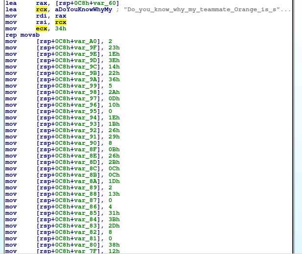

# CTF HW0 Writeup

  - Nickname: unicorn011
  - Student ID: B04901011
  - Real name: 吳宛臻

### Problem 1: Shellc0de (pwn)

#### Problem description

> We are provided with a binary file called shellc0de and a c file which describes the process. It takes a maximum input of `0x100` from the user, checks if restricted character are present and executes whatever was entered.

#### Solution
> From the c file we can see this is a simple shellcode execution program. All we have to do is connect to the server, input shellcode that spawns a shell, and then we can find the flag hidden on the server!

> First, using `file` we can see that the binary is a `64 bit x86-64 ELF run on Linux, unstripped`, which means if we use pwntools we have to specify `context.arch = amd64`. Initially I tried to write my own asm code to extract the shellcode but somehow it kept failing, so I resorted to using `shellcraft` in pwntools to create valid instructions. 

> Finally, because of the restricted characters `\x00\x0f\x05`, which corresponds to Nullbytes and the `syscall` instructions that must be present in x86-64 machine code, we need to transform our shellcode. I experimented with xor encoding and other obfuscation techniques, but nothing worked, so in the end I still used the `encoder` module to avoid restricted characters.

> The resulting code is in `exploit.py`. It connects to the server, crafts shellcode with `sh()`, encodes the code and sends it to the server to get an interactive shell. We find our flag in `/home/shellcode/flag`. As a side note, I also tried to directly craft shellcode that cats the flag and it works as well!

### Problem 2: open my backdoor (web)

#### Problem description

> We get a website which shows the image of a door(from doraemon?), and clicking into the door we see the backdoor php source code.

#### Solution
> The php takes user input from both `post` and `get` methods. The first four letters of `_GET[87]` value is xored with `d00r` and then executed as a function with `_POST[#]` as input arguments. We know the key of `_POST` is `#` because the program counts the number of whitespaces in the second line of the file and converts it into an ascii character with `chr()` for indexing the `_POST` array. There are 35 whitespaces so `chr(35)='#'`. We can can enter anything with the post method since it doesn't check for length or other character restrictions. So now we know we have a command injection vulnerability to exploit. 

> The function we want to execute, that has exactly four letters, is the `exec` function, so the value of `_GET[87]` should be `"exec" ^ "d00r"`. We compute this value and convert into url notation `'%01HU%11'`. For `_POST[#]` we can use reverse shell to rebound the server shell onto our local nc listener.


### Problem 3: m4chine (reverse)

#### Problem description

> We get a `pyc` file (python bytecode), and executing it we are prompted for input which is tested against the flag and responds 'wrong' or 'You get the flag'.

#### Solution
> Since this is a reversing problem, we can either dynamically analyse it with gdb or decompile it and reverse the source python code. I found a python reversing module called [uncompyle6](https://github.com/rocky/python-uncompyle6) and decompiled the pyc file into python3.7 code.

> From the code we see that the program emulates a machine by taking input instruction codes and performing the corresponding functions on the input flag sequence. The instructions do add, subtract, and compare computations, and terminate if any of the comparisons fail. I copied the file, deleted the assertions, and added print functions to dump the sequence of instructions into assembly-like commands. The result looked something like this.

```sh
sub
push 8
add
cmp
terminal
....
```
> Then it was fairly simple. I did the calculations and reverted the bytes representation into hex with the hint FLAG{} and got the flag.


### Problem 4: encrypt (crypto)

#### Problem description

> We get a ciphertext and a python encryption program. Decipher to get flag.

#### Solution
> The python code tells us that the cipher reads a one byte key, translates the 8 bits of the key into 8 stages of encryption, and performs the computation on the 16-bytes long flag input, and outputs the results as the ciphertext file. 

> If you look into the encryption functions, you'll immediately see that the cipher is **deterministic** because it uses the seed `oalieno` every time, so the xor and shuffle sequence is always the same. In addition, during encryption the bytes are independent since they are computed against the deterministic sequence instead of each other, so modifying one byte in the plaintext only affects one byte in the ciphertext. This means we can brute force each byte of the flag!

> Since we know the plaintext must begin with `FLAG{` and that the key is must be a printable ascii character, my first instinct was to brute force the key. I iterated from 33(ascii '!') to 126(ascii '~'), and compared them to our ciphertext. There were multiple matches which produced identical ciphertexts, so I chose 115(ascii 's') as my key. The flag is only 16 bytes long and we already know 6 of them (the beginning `FLAG{` and ending `}`), so I brute forced the remaining 10 bytes. The code can be found in the main function of `crypto.py`, which is a modification of the original problem file.

### Problem 5: Winmagic (misc)

#### Problem description

> The problem comes with a windows exe, pdb, and cpp, and instructs us to debug the program. The cpp has comments on how to use Visual Studio.

#### Solution
> From the cpp I supposed we should set up visual code, so we created a new project, added the exe, pdb, and cpp, and tried to run it with debugging symbols. But we couldn't. We were either missing the `pch.h` header file or unable to link the pdb with the exe. We tried on different computers and googled for some time but still failed to set up the correct environment. So we gave up and threw it into IDA.

> From the cpp we know that the key is xored with the cipher if password is correct. So the key and cipher must already exist in the data of the program. We searched for the xor part and found the cipher (see below). We did the xor by hand and retrieved the flag.


