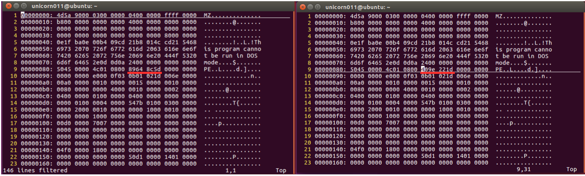
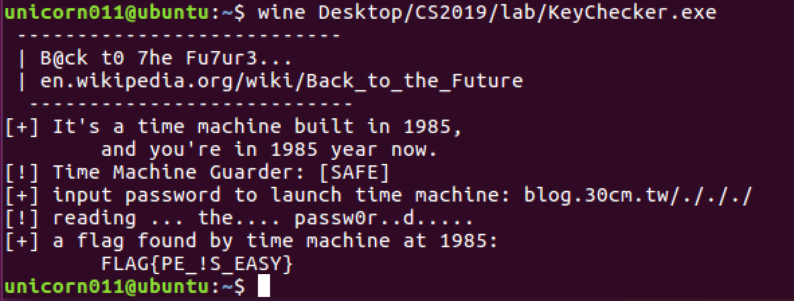
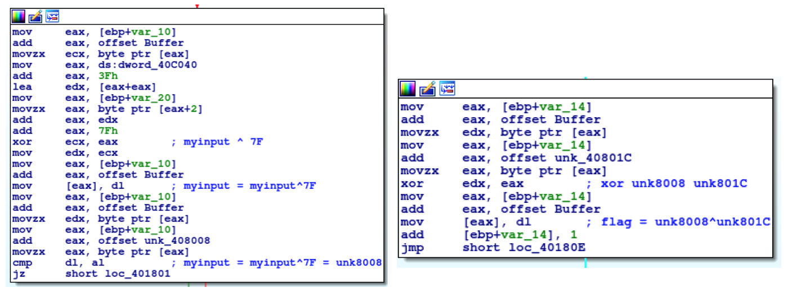

# CTF HW1 Writeup

Topic: Windows reversing

### Problem 1: 

#### Problem description

> We get a windows executable which tells us that the time machine was built in 1985, but the current year is 2019 so we may have difficulties using the time machine.

#### Solution

> We actually found 2 solutions to the problem. The intended solution was probably by changing the date in the header to successfully run the binary in year 1985, then input the correct password to get the flag, but our first success was from reading the assembly directly XDDD

**Solution 1:** 

> Executing the binary, it tells us the current year is 2019 and gives a warning on using the time machine in the wrong year, so first we have to somehow change the year to 1985. The binary calls the function `time()` so we assumed changing the system date would work, but unfortunately the binary still outputs year 2019. We decided to change the file headers with PE-Bear to see if it works and it did! The binary now assumes year 1985 and we get no warning! Note: I work on a mac and can’t use PE-Bear, so I directly modified the binary with vim+xxd. The hex `1d229e40` is calculated as `seconds after 1970/1/1` per documentation of `time()`, so I used 15.5 years * 365 days * 24 hours * 3600 seconds. Any number within the range of year 1985 should work.

> Next, we dive into the assembly and see that the user input (time machine password) is xored with 7F and compared with a sequence stored at `unk8008`. So we get the valid input by doing `unk8008 ^ 7F` and get the password `blog.30cm.tw/./././` , and we get the flag!

**Solution 2:**

> The second solution is reading the assembly directly. After the input is xored and validated with predefined `unk8008`, it is set to `unk8008` and xored with another sequence `unk801C` to get the flag. So all we did was read the two sequences from the memory and xored them to get the flag.

