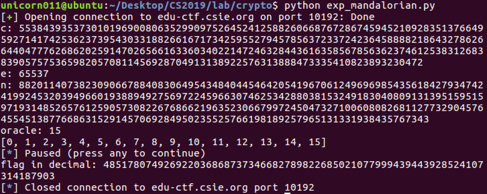

# CTF HW10 Writeup

Topic: Crypto

### Problem 1: Mandalorian

#### Problem description

> This is a typical rsa system in which the server generates a new pair of primes(512 bits) to create the keys and use for encryption and decryption. The service menu has two options: show the public key and ciphertext, and decrypt a message and show the last byte. So we have a chosen ciphertext attack here.

#### Solution

> We tried two attempts on this challenge. First we thought we could do Fermat's factorization because both p q were 512 bit primes so they probably weren't too far apart (q < p < 2*q). We wrote a simple implementation with sieves optimization, but the program ran for a bit long so we were sure that was a wrong direction.

> The second attempt was a LSB oracle attack (Least Significant Bit), since the decryption only gave us the last 4 bits of the plaintext. We could use the oracle to approximate the relationship between the modulus n and plaintext m. Details can be found [here](https://github.com/ashutosh1206/Crypton/tree/master/RSA-encryption/Attack-LSBit-Oracle). We wrote the python script with pwntools and gmpy2, to take care of the remote process and math computations. As a side note, we had to set the precision of the fractions and decimals because we needed 400+ bits precision so that we don't get a crappy decrypted flag. In addition, the last byte of the decrypted plaintext is messed up, so we have to guess our own last byte, which should be obvious because of the flag format ;)

> This is the easiest challenge this semester!