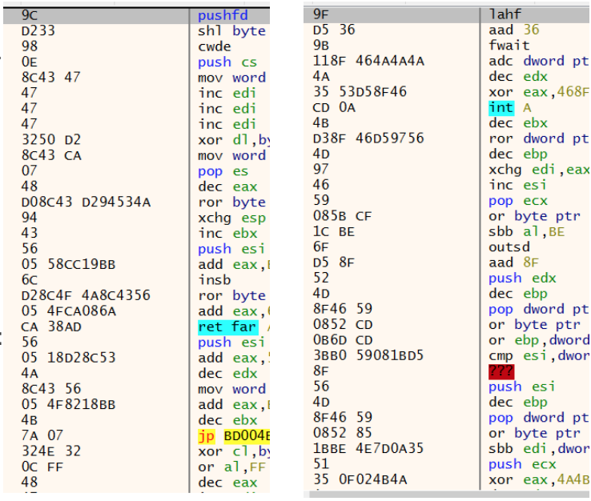
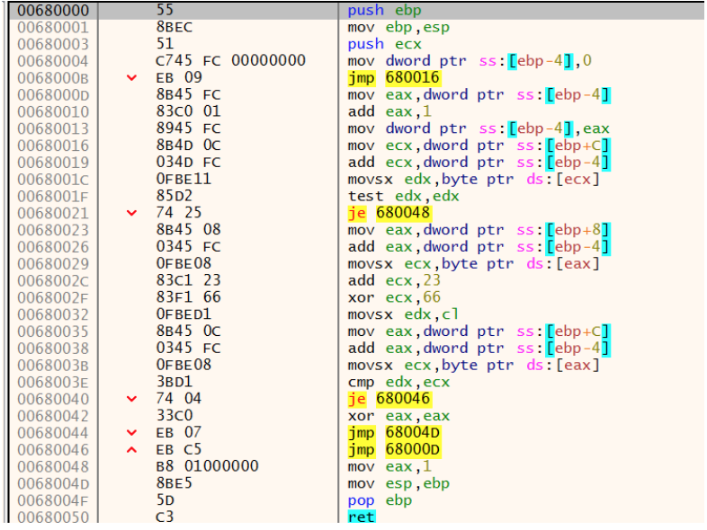

# CTF HW2 Writeup

Topic: Windows reversing

### Problem 1: Idamudamudamuda 

#### Problem description

> We get a windows executable which prompts for a seed and the flag.

#### Solution

> Using x32dbg, we see that the program is a flag checker with two passes. First it asks for a seed which is then fed into another function, and then it asks for the flag which is fed to another function dependent on the seed. It is impossible to solve the problem with static analysis because the actual flag checking program is generated after we input the seed. In other words, we have to input the right seed in order to create a valid flag checking function. 

> The screenshots here are two functions generated. The output is different for each seed, and we can see that the function instructions are a bunch of nonsense. However, we notice an important observation: the instructions are all shifted with the same offset. This means we can generate a valid shellcode sequence if we know the correct offset. Second, recall that each function begins with a common calling convention. 
> The first instructions are always 
`push ebp
mov ebp esp` 
> which corresponds to the shellcode `55 8B EC`. After a few tries we discover that the last byte of our seed is used as the offset, and that our shellcode is valid when the last byte of the seed is `0x10`. Therefore, we choose decimal 16 as our seed(which translates to `0x10`). Now we get the following flag checker shellcode.

> We see that our flag input is calculated with `(flag + 23)%66` and compared against data stored at `ebp+C`. We fish out the byte sequence in `ebp+C` and reverse the correct flag.
