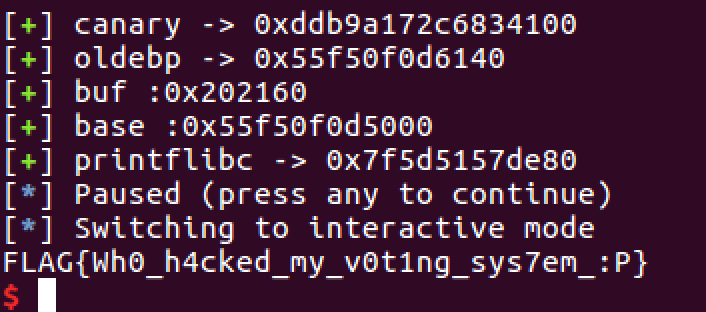
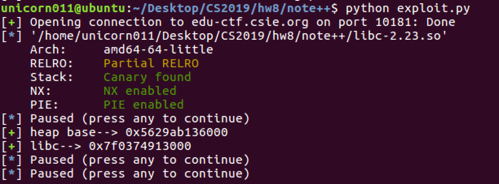
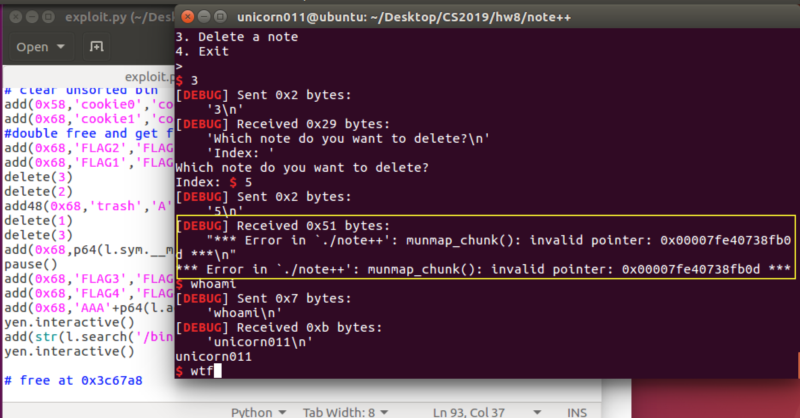
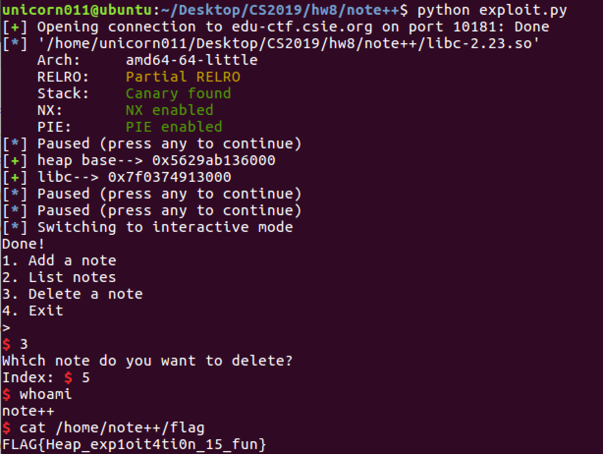

# CTF HW8 Writeup

Topic: Binary

### Problem 1: Election

#### Problem description

> The binary runs an election in which we are allowed to register identity tokens and cast 10 votes per token. We can also write messages to the candidates, but the length of messages are proportional to the number of votes the candidate has. 

#### Solution

> This time all the security protections are open, so we cannot use shellcode and have to leak the binary base and libc address. At first sight there doesn't seem to be any vulnerabilities, because all index boundaries are checked and format strings are safe. The only size mismatch we find is the `memcpy()` of `buf` and `token`, which we can use to leak the 0x10 bytes after `token`. If the `memcpy` fails when we try to login, we get an 'Invalid token' message, which acts as an oracle, so we can leak the bytes after `token` by bruteforcing the last ten bytes of `buf`. Since `token` is on the stack, the leaked information is the canary(0x08 bytes) and old ebp(0x08 bytes).

> If we look into the leaked ebp address, we'll find that it's located in the csu_init function in the binary codebase, so subtracting the csu_init offset we get the binary base address and thereby bypass PIE. This is useful since we can then find the addresses of `print@got`, `puts@got`, `main`, `csu`, and other gadgets. We have to use these to chain our ROP.

> The next step is to write our ROP chain, but we don't have enough space anywhere! The maximum votes a candidate can obtain is `uint8` (256 bytes), but the `msg` buffer is 0xe0, which is 0x1f bytes shorter. This means we can only overwrite the canary, old ebp, and return address. This is not enough to put our entire ROP chain, so we have to do stack pivoting. But where should we stuff our ROP payload? A good option would be `buf` that we used when registering a token, since global variables are stored in the bss segment(which is writable), and there is nothing after `buf` (all NULL in memory) so it is easier to satisfy one gadget constraints, which often require NULL memory after rsp, such as `[rsp+0x30]=NULL`.

Okay, so our exploit flow is as follows:
* Leak canary and old ebp by bruteforcing the login oracle
* Run a loop to register many tokens and vote for one candidate until the candidate has 256 votes
* Register and login again to put our ROP payload into `buf`
* Send message to candidate and overflow the buffer to do stack pivoting --> move stack to `buf`
* Run ROP chain to: leak libc address --> write new gadget --> jump to new gadget --> get shell!

> The first two steps are simple. We write a small function to bruteforce the login oracle and leak the canary and old ebp, and then we use old ebp to calculate the code base and find the addresses of all our gadgets. The tricky part is to craft our ROP payload. Recall that we are doing stack pivoting to move our entire stack to `buf`. After the stack is migrated there is no way to move the stack back, so we cannot return to main or other functions because it will crash. We have to complete our exploit in **one** try, but we still have to leak the libc address and there is no other place where the program can take user input. We were stuck here for a while, but then we realized we could find another empty writable area(address known) and use the `read` function to take user input(another ROP chain) and stuff it into this new gadget, then jump over to the new gadget. We picked 0x100 bytes after `buf`, mainly because it was really empty over there and we already know the address (`buf+0x100`). We elect to use `ret2csu` (because we have never used it and wanted to practice XDD) to call the `read` and then pad `7* (8*'\x00')` to fill all the registers before we jump to the new gadget when `csu` reaches `ret`. 

> We tried both one gadget and the usual `system('\bin\sh')` and both worked, but in the code we only leave the syscall method and send `cat flag` to print out the flag directly. PWNED!

### Problem 2: Note++

#### Problem description

> The challenge is similar to the Note lab, but is way harder since the program keeps a flag to check for double free, and all input is bounded within buffer sizes. All data structures are global, so we never get to touch the stack at all. The challenge uses malloc and free a lot, so the entire exploit has to be done on the heap. Also, since we can't control anything on the stack, there's no way to overwrite the return address, so we can't do ROP either. Our only hope is to overwrite malloc_hook and use one gadget, because the malloc is restricted to 0x78 and it's impossible to write to an address smaller than 0x78...

#### Solution

> We were staring at the code for an hour because we didn't find anything suspicious. At first we trusted the comments saying `scanf` and `note` were safe from information leak QQQ, but then we noticed the 'off-by-one' vulnerability, in which `scanf` reads 0x48 bytes BUT appends a null byte. We can't do anything with a null byte, of course, but the trick is that `is_freed` is stored directly next to `description`, so the null byte of a previous note's `description` will overwrite the next note's `is_freed`, therefore we can make the second (overwritten) note double-free-able! Once we are able to double free, we can do fastbin attack to jump to a fake chunk. Of course, we will have to leak libc address with unsorted bin attack first, but malloc sizes are restricted to 0x78 so we can't just malloc(0x100) and free it to get libc address. To bypass this, we did a fastbin attack + heap overlap to create a chunk with size 0xb0, then freed it to get the address of main_arena in libc. The final cleanup was the hardest, in my opinion, but we succeeded by performing another fastbin attack and overwriting malloc_hook with a one gadget.

The exploit flow is as follows:
* Use off-by-one to do double free and leak heap base address and make note 2 double-free-able
* Create fake chunk with note 2, which points to an address in the heap, between two allocated small chunks
* Use the allocated chunk before the fake chunk to do heap overlap and overwrite the size of the fake chunk to 0xb0 
* Free the fake chunk, which gets thrown into the unsorted bin! 
* Use off-by-one again to leak the libc address from the fake chunk
* Clear all used chunks since we need continous space and more indexes for the final cleanup
* Use off-by-one again to do double free and fastbin attack --> fake chunk overwrites malloc_hook with one gadget

> Let's clarify how to do each of the components first. 
> Off-by-one means we can change a the `is_freed` flag of a freed chunk(ex: `note[i]`) from true to false by filling all 0x48 bytes of the `description` of the previous chunk(ex: `note[i-1]`), which means we can double free `note[i]` and also read the data contents of `note[i]` by `show()` because it is flagged as in use. This is the main method we use to leak information and create double-free-able chunks.

> Fastbin attack means we can exploit double free and jump to a fake chunk(which we can set to be at an arbitrary writable memory address). This is useful since we want to overwrite the `malloc_hook` to get shell, but we also used this method to create the unsorted bin size chunk.

> So the first step is simple, we create a few chunks, say `note0 note1 note2 note3 note4 ...` and free them backwards. Now we have in fastbin `note3 -- note2 -- note1`, and then we malloc `note1` with description `'A'*48` and show the notes. We'll see that `note0 note1 note2 note4` are all in use, and the contents of `note2` contains the address of the header of `note3`! We leaked the heap address! Note that we have to free `note3` before `note2` because we want to double free and leak `note2`, but if `note2` was the first freed chunk then it will not contain a heap pointer(0x0 instead). 

> Leaking the libc address with unsorted bin attack was tricky. Since the program restricted malloc size to 0x78, which is in fastbin, we have to create a chunk with size > 0x90, then free it to throw it into unsorted bin without using malloc. I recall the ppt containing something about heap overlapping, so we decided to point the fake chunk(`note4`) to an area in the middle of a regular chunk, say `note6`, then free & reallocate `note6` to rewrite its data and overwrite the size of `note4`. Since the deleting a note doesn't check its size, we can then free `note4` and throw it into unsorted bin! Afterwards we just have to repeat step 1 and use `note6` to leak the libc address in the freed `note4`. The interesting thing is that when we tried to free `note4`, we triggered an actual double free error. After some researching we discovered the reason: when you try to free memoryA, the program checks if there is another valid chunk header after `memoryA + size(memoryA)`, so we added another two chunks with size 0x78 so that the fake chunk overlaps and sticks next to them.

> Okay, now that we have both the heap address and libc address, we can proceed to perform another fastbin attack and jump to an address near `malloc_hook` just like we did in the lab, and then overwrite the hook to get shell. But before that, there are a few problems. First, we can only create 10 notes, but we have already used too many indexes and need to clear them out so that we have 3 adjacent 0x68 chunks to do the fastbin attack. Second, we can overwrite `malloc_hook` with `system`, but when we later need to input the address of `/bin/sh` it is too large to pass the 0x78 size check. Third, we could try to overwrite `free` because it takes a string as an input(which is perfect because we just have to type '/bin/sh' instead of finding a bss segment), but unfortunately that wouldn't work because I checked the memory around `free` and it was empty for 0x300+ bytes, which means we can't find a fake chunk there to satisfy the 0x78 restriction. 

> Unfortunately we're left with one option: one gadget. You could try, but each one of them would fail because we can't control anything on the stack. So there's no way to control the registers or memory after rsp. BUT we remembered something the TA did in class: he deliberately let the program crash because during faults the registers and memory would jump to somewhere clean, which somehow did satisfy the constraints. That was exactly what we attempted. We knew we could trigger a double free error on purpose if we manually deleted the unsorted bin chunk again in interactive mode, so we did and somehow the program crashed and gave us a shell! A miracle!

