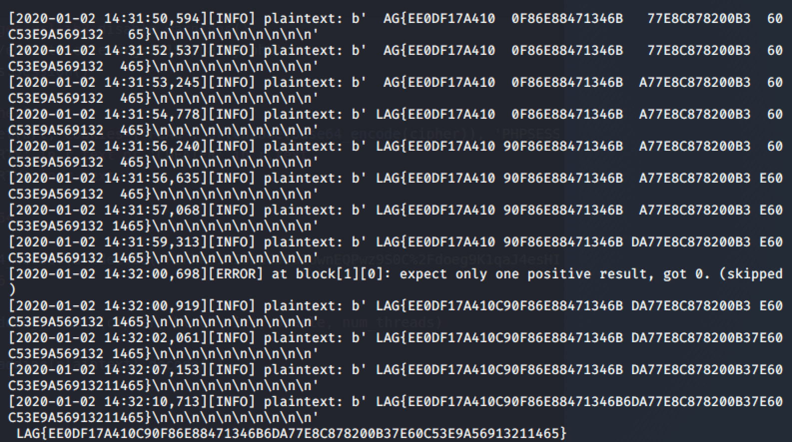

# CTF HW9 Writeup

Topic: Crypto

### Problem 1: Cathub party

#### Problem description

> This is a padding oracle attack problem. We can get the encrypted cookie FLAG after logging in to the party. The flag is base64 encoded and then url encoded, so we have to remember to do the right decoding and encoding when sending the payload.

#### Solution

> The idea of padding oracle is that you have a system that tells if you got the padding right in some encrypted value, so we can try to guess the last value in every block and go backwards to decrypt the entire string. I first tried to use padBuster, but the first byte in every block( block_size=16 ) is always wrong, so we found another tool to use instead. It was simple to use this tool. We just have to turn of certificate verification and disable the urllib warnings, then set the cipher as the cookie FLAG along with PHPSESSID, and we get our flag!

