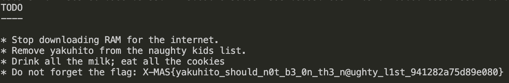

# X-MAS CTF 2019 writeup
* 2019/12/13 - 2019/12/20
* Crypto: Mata Nui's Cookie, DeFUNct Ransomware, Robin's Wish
* Reverse: Santa's crackme, Reverthable X-Math
* Binary: SN0WVERFL0W
* Web: Sequel Fun
* PPC: Orakel
* Misc: FUNction Plotter, SNT DCR SHP

** Sanity checks and forensics are not included **
** solution code for is in src folder **

## Mata Nui's Cookie
This challenge was categorized as crypto but it has nothing to do with crypto really...
We get an image this image

### Solution
> Since we know the first five chars must be `X-MAS`, we can deduce that vertical, horizontal, and diagonal lines are solid, and curves must avoid the circles. All other patterns are invisible. We can then match each picture with a letter of the alphabet and get the flag.

### Flag
`X-MAS{MATANUIHASPREPAREDTHECOOKIES}`

### Notes
fun but too easy haha.

## DeFUNct Ransomware
This is a textbook RSA problem. We get a text file containing `n` and `e`, and another encrypted file.

### Solution
> The first thing we do is throw the large `n` into a defactorization tool, which in this case we used this [online calculator](https://www.alpertron.com.ar/ECM.HTM). It turns out that this number is not a product of two large primes. 
`n (1233 digits) = a**2 (309 digits) * b**2 (309 digits)`
> But since p and q have to be coprine, we can assume one is `a**2` and the other is `b**2`. We can calculate all the needed parameters and get p, q, phi and finally d. Now we just have to decrypt with `c**d mod n` to get the plaintext!

> solution [here](src/rsa.py)
### Flag
`X-MAS{yakuhito_should_n0t_b3_0n_th3_n@ughty_l1st_941282a75d89e080}`

### Notes
This is similar to other simple crypto problems. Usually you either get a small e or easily factorizable n or some other vulnerability.

## Robin's Wish
challenge description here

### Solution

> solution [here](src/AAAA.py)
### Flag

### Notes

## Santa's crackme
Input the license key and the binary will tell you correct or not

### Solution
Use ltrace and input a LONG key like this

Then we can figure out that the left column is like to be the XOR of our input and `something` and the right column is XOR of `flag` and `something` , So Let's run the binary again with input = right column then get the flag(with ltrace on).

> solution [here](src/AAAA.py)
### Flag
X-MAS{54n74_15_b4d_47_l1c3n53_ch3ck1n6}}
### Notes

## Reverthable X-Math
challenge description here

### Solution

> solution [here](src/AAAA.py)
### Flag

### Notes

## SN0WVERFL0W
challenge description here

### Solution

> solution [here](src/AAAA.py)
### Flag

### Notes

## Sequel Fun
challenge description here

### Solution

> solution [here](src/AAAA.py)
### Flag

### Notes

## Orakel
challenge description here

### Solution

> solution [here](src/AAAA.py)
### Flag

### Notes

## FUNction Plotter
challenge description here

### Solution

> solution [here](src/AAAA.py)
### Flag

### Notes

## SNT DCR SHP
challenge description here

### Solution

> solution [here](src/AAAA.py)
### Flag

### Notes

markdown [cheatsheet](https://github.com/adam-p/markdown-here/wiki/Markdown-Cheatsheet)
