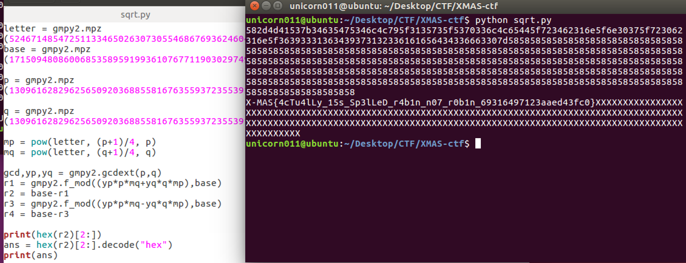
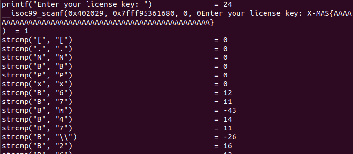
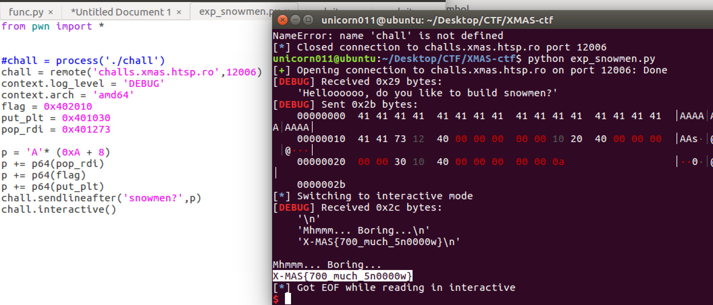
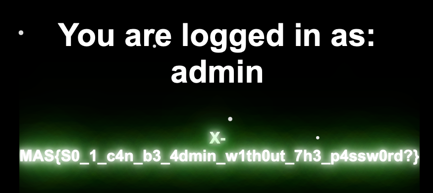
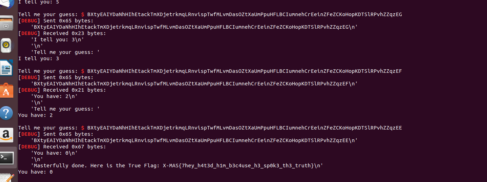
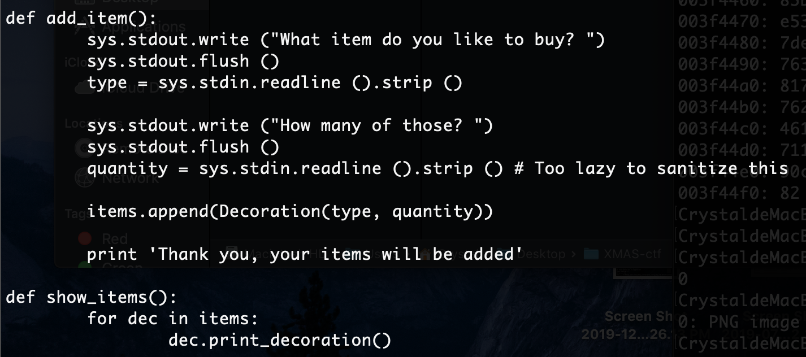
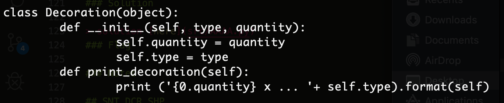
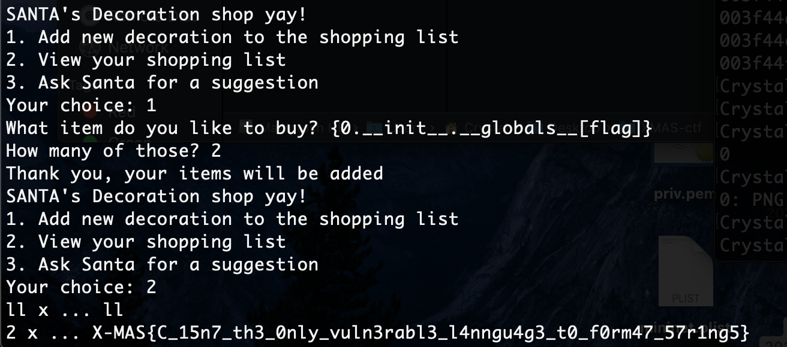

# X-MAS CTF 2019 writeup
* solved by: unicorn011, iamsteven
* 2019/12/13 - 2019/12/20
* Crypto: [Mata Nui's Cookie](#Mata-Nui's-Cookie), [DeFUNct Ransomware](#DeFUNct-Ransomware), [Robin's Wish](#Robin's-Wish)
* Reverse: [Santa's crackme](#Santa's-crackme), [Reverthable X-Math](#Reverthable-X-Math)
* Binary: [SN0WVERFL0W](#SN0WVERFL0W)
* Web: [Sequel Fun](#Sequel-Fun)
* PPC: [Orakel](#Orakel)
* Misc: [FUNction Plotter](#FUNction-Plotter), [SNT DCR SHP](#SNT-DCR-SHP)

** Sanity checks and forensics are not included **
** solution code for is in src folder **

## Mata Nui's Cookie
* solved by unicorn011

This challenge was categorized as crypto but it has nothing to do with crypto really...
We get an image this image

### Solution
> Since we know the first five chars must be `X-MAS`, we can deduce that vertical, horizontal, and diagonal lines are solid, and curves must avoid the circles. All other patterns are invisible. We can then match each picture with a letter of the alphabet and get the flag.

### Flag
`X-MAS{MATANUIHASPREPAREDTHECOOKIES}`

### Notes
fun but too easy haha.

## DeFUNct Ransomware
* solved by unicorn011

This is a textbook RSA problem. We get a text file containing `n` and `e`, and another encrypted file.

### Solution
> The first thing we do is throw the large `n` into a defactorization tool, which in this case we used this [online calculator](https://www.alpertron.com.ar/ECM.HTM). It turns out that this number is not a product of two large primes. 
`n (1233 digits) = a**2 (309 digits) * b**2 (309 digits)`
> But since p and q have to be coprine, we can assume one is `a**2` and the other is `b**2`. We can calculate all the needed parameters and get p, q, phi and finally d. Now we just have to decrypt with `c**d mod n` to get the plaintext!

> solution [here](src/rsa.py)
### Flag
`X-MAS{yakuhito_should_n0t_b3_0n_th3_n@ughty_l1st_941282a75d89e080}`

### Notes
This is similar to other simple crypto problems. Usually you either get a small e or easily factorizable n or some other vulnerability.

## Robin's Wish
* solved by together

Connect to server and we can get the codeword. We can test our message and get the codeword on the server. e.g. input:2 -> output:4 , input:'gg' -> output: 700713841 = `((103*256 + 103)^2)` 

### Solution
> First we assume the codeword should be the square of the message, BUT we check the codeword of flag and it is not a perfect square. So we test 10^x (x = 0 -> inf), and the result is usually its square. But when we reach x = 104 ,the output is not as expected. We found the border between 13e104 to 14e104. Then we guess the encryption formula = `x^2 mod(blah)`, and found blah to be the distance between square(14e104) and its codeword. 

> Then we realized this is RSA when e=2! So we googled and found the [rabin system](https://en.wikipedia.org/wiki/Rabin_cryptosystem) which is exactly the same! We implemented the decryption algorithm and got the flag.

> solution [here](src/sqrt.py)

### Flag
`X-MAS{4cTu4lLy_15s_Sp3lLeD_r4b1n_n07_r0b1n_69316497123aaed43fc0}`

### Notes
We spent some time figuring out the encryption system, seems like crypto problems are often transformations of rsa...

## Santa's crackme
* solved by iamsteven

Input the license key and the binary will tell you correct or not

### Solution
> Use ltrace and input a LONG key like this.

> Then we can figure out that the left column is like to be the XOR of our input and `something` and the right column is XOR of `flag` and `something` , So Let's run the binary again with input = right column then get the flag(with ltrace on).

### Flag
`X-MAS{54n74_15_b4d_47_l1c3n53_ch3ck1n6}`

## Reverthable X-Math
* solved by iamsteven

This is a simple LISP program with a short output
`47/22/9/55/-41/59/39/97/-38/-38/108/42/41/-47/-46/-38/-38/22/46/110/22/46/23/20/45/46/47/20/-45/46/103/0`
> source [here](src/task.lsp)

### Solution
> Go to an online compiler and test some 1-byte different input, figuring out that the same character result to same answer regardless of the location (1 to 1 function). 
> We can observe the output and see that the flag has length 32, then we can test the bits one by one and get the flag.

### Flag
`X-MAS{= l0v3 (+ 5t4llm4n 54n74)}`

## SN0WVERFL0W
* solved by unicorn011

This is a simple bof problem. Only NX is enabled, so there is no canary or PIE. 
The program asks you if you want to build a snowman, takes a line of input, then sends a line in reply. The challenge does not contain source code, but it does attach a dockerfile from ubuntu 18.04.

### Solution
> I threw the binary into IDA because it was stripped and I didn't want to reverse it with gdb. You can see that there is a variable `flag` stored in the binary(in plaintext), but it is **redacted** in the given binary so you must print it out on the server. Also we can read the elfsymbols from gdb.

> After obtaining all these addresses, we can do a simple rop and print out the flag. The exploit works as follows.

> solution [here](src/expsnowmen.py)

### Flag
`X-MAS{700_much_5n000w}`

### Notes
I didn't try to get shell because I found the flag in the binary. On second thought, if we had to read the flag from another file on the server, we could have chained rop and read input after leaking libc.

## Sequel Fun
* solved by together

We see a typical login prompt.

### Solution
> Since the challenge name says 'sequel', we can reasonably assume that the solution is simple SQL injection. We test some simple payloads from lab exercises and discover that 'o', 'O' and '1' are forbidden. So the exploit is straightforward:
`admin' AND 2=2 -- `

### Flag
`X-MAS{S0_1_c4n_b3_4dmin_w1th0ut_7h3_p4ssw0rd?}`

### Notes
.....this is even easier than our lab practices....

## Orakel
* solved by iamsteven

Santa told me about you...

I will give you the True Flag you seek, but for that you must pass my test:
I will think of a word of great length, known only by the gods that roam Lapland.
You must guess which word I am thinking of, but only under a limited number of 1000 tries.
In order to make this possible for you, I will tell you how close you are to my word through a number.
The higher the number, the further you are from my word.
If the number is 0, then you have found it.
Good Luck.

Server will return the distance between your input and the real word(not flag), so this is a guess-number(word) game.

### Solution
> We have to guess the real word with lowest tries, the answer-set is `[a-z][A-Z]` so my algorithm is: first guess `z` and `A` ,if A is closer, then guess k,l.....etc (always guess the middle).
> We can get the correct one by expection around 9.25 times per character.
> solution [here](src/Orakel.py)

### Flag

### Notes
Server may timeout randomly :(

## FUNction Plotter
* solved by unicorn011

We connect to the server and is required to answer 961 math problems such as `f(23,4)=?`. 

### Solution
> We tried for a while. First I thought it was a programming problem. Maybe we had to answer the mean or sum of the two numbers before the program timed out. After some tries we discovered that the only valid answers were 0 and 1. If we correctly guessed the number we get 'Good!', so I decided to write an automated script and send 0's to see which answers were 0 and which were 1. I thought the sequence of 0's and 1's would translate to the flag string or something, but after two tries the sequences were entirely different so I discarded that idea.

> After a while my boyfriend told me the math problems were coordinates, so I reran my script and recorded the coordinates, then printed out the matrix. 961 is the square of 31, which is definitely something like QRcode. We solved another QRcode problem last time so we threw the image matrix into this [site](https://bahamas10.github.io/binary-to-qrcode/?fbclid=IwAR2ijmgcNm_NJe6Yb_DDIs2eTJuKeGvAq3YgqsBjZp_pGYYroHcaTE01PUg) and got this QRcode. Scan it and we get our flag!

> solution [here](src/func.py)

### Flag
`X-MAS{Th@t's_4_w31rD_fUnCt10n!!!_8082838205}`

### Notes
Fun challenge! 

## SNT DCR SHP
* solved by iamsteven

We connect to the server and enter Santa's decoration shop! It's a menu challenge like the pwn challenges. In the challenge we can: add new decoration, view shopping list, or ask santa for suggestion(print source code).

### Solution
> From the source code we can see two functions `add_item()` and `print_decoration()`. 

> After we add decorations, the `type` and `quantity` are directly saved to `items` with sanitization. Then when we try to print the list of decorations, we have a format string vulnerability. A bit of googling brings us to this [bug report](http://lucumr.pocoo.org/2016/12/29/careful-with-str-format/), so we can control `type` to input a malicious format string! The final exploit is as follows:

### Flag
as above...

### Notes
Fun challenge! Learned something about python format strings!
