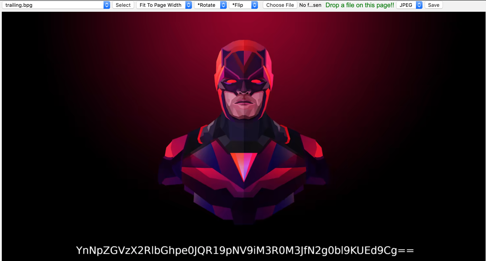

# Jorge Luis Borges
* bsides delhi ctf 2019/20190928
* forensics/100 points/1000 points

### Challenge
We get a PNG file.

### Solution
This is a really simple challenge. We get a PNG file and checking it with hexdumpwe see trailing data after the PNG. The data extracted appears to be a BPG file, which we view in a online image decoder. We get this picture below. Decoding the string with base64, we get the flag.

### Flag
bsides_delhi{BPG_i5_b3tt3r_7h4n_JPG}

