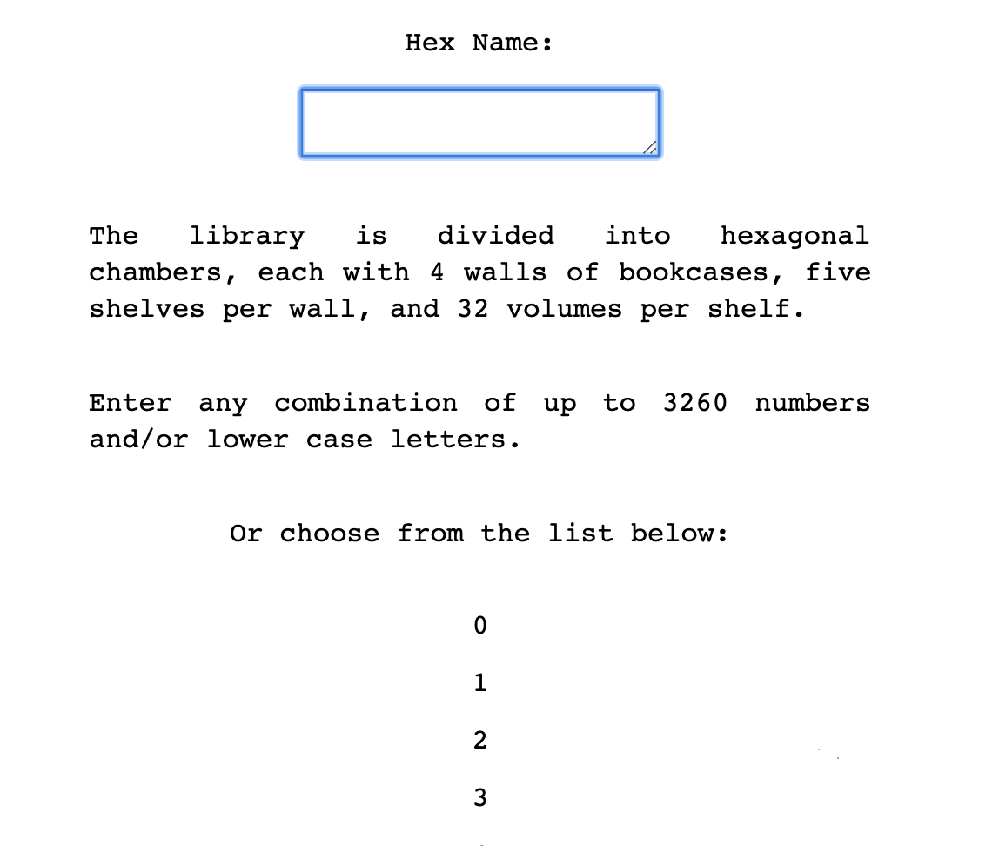

# Jorge Luis Borges
* hackcon19/20190823
* misc/490 points/500 points

### Challenge
Bruh, do you even read books, lol? Then solve this: ++++++++++[>+>+++>+++++++>++++++++++<<<<-]>>>>++++++++++++++++++++.<++++++++++++++++++++++++.<++++++++++++++++++++++.-------.++++++.--.+++.>>.<.<-.--------.+++++++.+++++..------.>>.<.<+.-----.++++++++++.++.----.-.>>.<<---------.++++++++++++.----.-.--.+++++++++++++.-------------.

### Solution
We are presented with three files: file1.txt, file2.txt, and desc.txt.
File1.txt contains a long array of hex digits, which translates into a bunch of meaningless ascii letters. We didn't know what to do with it so we set it aside.

File2.txt was more interesting. It started with a header `x=0, y=0, rule = B3/S23` which we googled and found out was related to a biological term *the game of life*. 

With further reading we found a software called *golly* specifically used to simulate cellular automation. It turns out that file formats like file2.txt were called pattern files, and golly to them as input and animated population growth. So we downloaded the software, searched for tutorials, and copy-pasted the contents of file2 into golly.
It looked like this.

We animated population growth but no further information was shown, so we did a bit more googlingand discovered that each `!` in the pattern file indicated the end of a pattern, and that there were three `!` in the file, so there were actually three patterns in the file. We pasted all three patterns and found a string text below.

Looks base64-encoded to me, so I decoded it and got this: `babel`. 

Desc.txt was a bunch of +-.<>[], and we found out it was an esoteric programming language called *brainfuck*. Using an online interpreter we got the following equation.

Solving with wolfram alpha gives us the roots x = 2,3,4,305

We now have a set of three clues but no idea how to use them. So we looked up `babel`, and surprisingly found out that Jorge Luis Borge wrote a famous novel called *The Library of Babel*. We found an online project implementing [The Library of Babel](https://libraryofbabel.info/), and clicking into browse, it asks us to input `hex name`, so we copied the hex translated ascii values from file1 into the form. Next it asks for the wall, shelf, book, and page values, so we entered the roots 2,3,4,305 respectively. And we get our flag!

### Flag
d4rk{daymsonureadbooksbiglol}c0de

### Notes
This is actually the most complicated but fun challenge we've done. It was very creative!
For reference:
* List of [esoteric programming languages](https://en.wikipedia.org/wiki/Esoteric_programming_language)
* interpreter for lots of esoteric programming languages: [Tio](https://tio.run/#)
