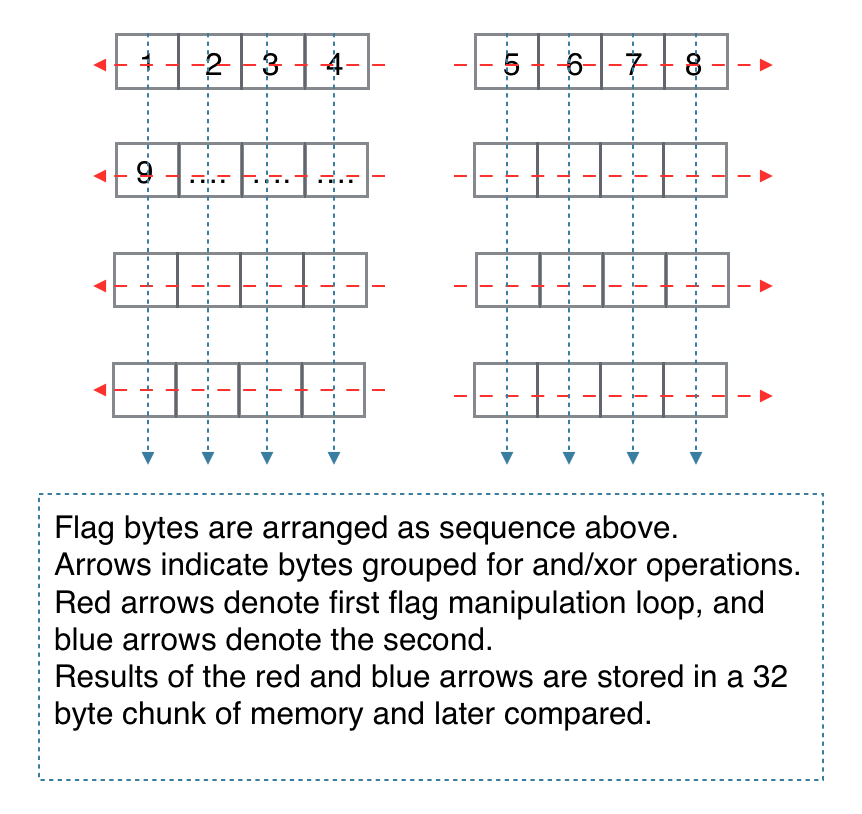

# East Crack Me
* Tokyo Westerns CTF/ 08/31/2019 
* reverse, warmup/ 88/500

### Challenge
We get a binary that accepts the flag as an input argument and outputs correct/incorrect.

### Solution
Unfortunately, since we don't have ida pro, we have to disassemble the program bit by bit. Our first instinct was to run the program with ltrace and gdb to see what functions the program uses to check the flag. 
From the first few tries, we discover that the flag should be 32 bytes long with the opening 'TWCTF{' and closing '}' sequence. That leaves us 32 bytes to figure out. We found `0123456789abcdef` with `strings` so we know the bytes are probably made up of these characters. 
We opened up ida free, and discovered that the program does five `memcmp` checks to determine the correctness of the flag, so we asssume there are four operations done the flag before the result of each action is checked against its resprectively predefined value.
Backtracking to the first function, we found the function `strchr`, which finds the occurrence of characters in a given string, in a nested loop. The outer loop continues for 16 iterations, which coincides with our previously found sequence `0123456789abcdef`, and the inner loop searches the entire string for the number of occurrences and saves the count into a separate chunk of memory. In a later block, the program checks if the count matches a predefined sequence, so we can be certain that in our 32 byte flag, each character must have a fixed number of appearances.
The program continues onto another string manipulation loop which takes four bytes of the flag at a time and computes the `and` and `xor` values. For example, operation the bytes `2d7a` would result in `ord(2)+ord(d)+ord(7)+ord(a)` and `ord(2)^ord(d)^ord(7)^ord(a)`. The opeartion loops for the entire flag unril all 32 bytes have been computed and saves the two 32 byte results into memory, later used for `memcpy`.
Finally, just before the flag is checked there is another operation loop which is quite similar as the previous one since it also only performs `and` and `xor` on the flag bytes. The difference is that the flag bytes are not grouped in four consecutively but rather selected after every 8 bytes. The logic is as below.

We have understood the operations and the desired results, now it's time to solve sudoku puzzle! We know there are various solvers available but we've got no experience in them and my teammate simply decided to do solve it himself. After an hour or so he came up with the valid flag sequence: `TWCTF{df2b4877e71bd91c02f8ef6004b584a5}`

### Flag
`TWCTF{df2b4877e71bd91c02f8ef6004b584a5}`

